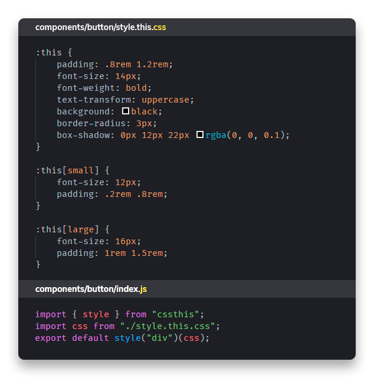

# cssthis

Cssthis is created for [**Preact**](https://preactjs.com) with the aim of protecting your styles by using random class selectors.

The main difference with [**css-modules**](https://github.com/css-modules/css-modules) is that with cssthis you do not need to know the root class, since cssthis will create a component that will wrap, similar to what it does [**styled-components**](https://www.styled-components.com/).

> If you are impatient and you want to try cssthis directly in the navigator visit this [codesanbox](https://codesandbox.io/s/18n4q5lpm7)

## Component example

When you call the function **style** inside **cssthis**, a component will be created that wraps the style and that when mounted will print the CSS in the browser.



## :this

It is a homologous selector to [**:host**](https://developer.mozilla.org/en-US/docs/Web/CSS/:host()), this is intended to be replaced by the className random generated by ** cssthis **, resulting in the encapsulation of the style sheet.
This is achieved through the use of [**csstthis-parse**](https://github.com/uppercod/cssthis-parse), which is designed to work in bundle environments(rollup, webpack and parceljs).


### Example 1

```css
:this{
    width : 20px;
    height : 20px;
}
```
> The expected result is that the container has the sizes assigned by the style sheet
### Example 2
```css
:this[button]{
    width : 20px;
    height : 20px;
}
```
> The expected result is that the container has assigned sizes only if the component is defined with the attribute **button**

### Example 3

```css
:this(button){
    width : 20px;
    height : 20px;
}
```
> The expected result is that the container possesses the assigned sizes only if the component is defined as a tag **button**, at the time of creation

### Example  4

```css
:this(h1,h2,h3){
    font-family : "Raleway";
}
```
> The expected result is that all the components created with the tag h1, h2, h3 will have the font defined in the style sheet.

### Example 5

```css
:this(h1,h2,h3):not([paragraph]){
    font-family : "Raleway";
}
```
> The expected result is that all the components created with the tag h1, h2, h3 will have the font defined in the style sheet, only if they are not accompanied with the attribute **paragraph**

### Example 6

```css
:this + :this{
    margin-left : 1rem;
}
```
> The expected result is that the component applies the style only if it is followed by itself, Example 2 continuous buttons

> To see more examples of how to use the **:this** selector, you can visit [cssthis-parse](https://github.com/uppercod/cssthis-parse)

## Installations in bundlers


| bundler | name | status | repo | npm |
|---------|------|--------|------|-----|
| rollup  | rollup-plugin-cssthis | ✅ | [gihub](https://github.com/uppercod/rollup-plugin-cssthis)| [npm](https://www.npmjs.com/package/rollup-plugin-cssthis) |
| webpack |...| 👷 |...|...|
| parceljs |parcel-plugin-cssthis| ✅ |[github](https://github.com/UpperCod/parcel-plugin-cssthis)|[npm](https://www.npmjs.com/package/parcel-plugin-cssthis)|
 


## style(string tag [,object props] )(string css)

This function allows you to create a unique component to accept the imported style sheet.

> This function allows you to create a unique component to accept the imported style sheet.

* **tag** : {string} , argument defines the tag for the component when it is mounted, you can replace it in the instance of the component by assigning it the attribute `tag ="<tag_html>"`

* **props**  : {object}, argument allows to interact with the style sheet, being able from the css to import properties within this object by using `this(<property>)`

* **css** :  [**cssthis-parse**](https://github.com/uppercod/cssthis-parse), Valid template css to create a function that interacts with **cssthis**

## Theme

The Theme component allows generating a comparative context of properties that will modify the default properties given by the object props to the style function

```js
<Theme color="black">
    <Button/>
</Theme>
```

> If button was a component created from the **style** function, you can use the color attribute

```css
:this{
  color : this(color);
}
```

> In this way **Theme**, allows to create components with dynamic style. [see example of Theme](https://uppercod.github.io/cssthis-demo/)