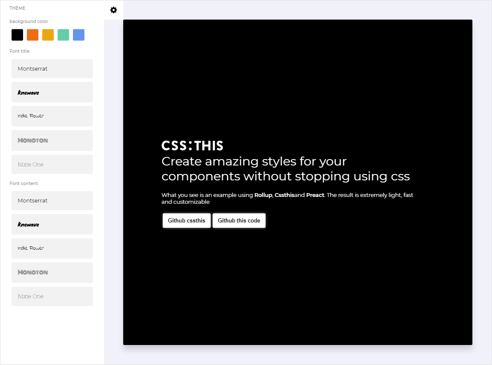

# cssthis

Es una pequeña librería para trabajar estilos de componentes de forma inteligente, rápida e intuitiva sin abandonar css.

## :this
Es un selector homologo a **:host**, este tiene la intención de ser remplazado por el className aleatorio generado por **cssthis**, logrando como resultado encapsular la hoja de estilo.
Esto lo logra mediante el uso de **cssthis-parse**, la que esta pensada para trabajar en entornos de bundle (rollup, webpack y parceljs).

### Ejemplo 1

```css
:this{
    width : 20px;
    height : 20px;
}
```
> El resultado esperado es que el contenedor posea los tamaños asignados por la hoja de estilo
### Ejemplo 2
```css
:this[button]{
    width : 20px;
    height : 20px;
}
```
> El resultado esperado es que el contenedor posea los tamaños asignados solo si el componente se define con el atributo **button**

### Ejemplo 3

```css
:this(button){
    width : 20px;
    height : 20px;
}
```
> El resultado esperado es que el contenedor posea los tamaños asignados solo si el componente es definido como tag **button**, al momento de crearse


### Ejemplo  4

```css
:this(h1,h2,h3){
    font-family : "Raleway";
}
```
> El resultado esperado es que todos los componentes creados con el tag h1,h2,h3 poseerán la fuente definida en la hoja de estilo.

### Ejemplo 5

```css
:this(h1,h2,h3):not([paragraph]){
    font-family : "Raleway";
}
```
> El resultado esperado es que todos los componentes creados con el tag h1,h2,h3 poseerán la fuente definida en la hoja de estilo, solo si no se acompañan con el atributo  **paragraph**

### Ejemplo 6

```css
:this + :this{
    margin-left : 1rem;
}
```
> El resultado esperado es que el componente aplicara el estilo solo si es seguido por si mismo, Ejemplo 2 botones continuos

>Para ver mas ejemplos de como usar el selector **:this**, puede visitar  **cssthis-parse**

## Instalaciones en bundlers

Mediante este [Plugin](https://github.com/uppercod/rollup-plugin-cssthis), ud podrá acoplar [cssthis-parse](https://github.com/uppercod/cssthis-parse) a su entorno de trabajo, puede ver la documentación directamente en el repositorio o npm.

| bundler | name | status | repo | npm |
|---------|------|--------|------|-----|
| rollup  | rollup-plugin-cssthis | ✅ | [gihub](https://github.com/uppercod/rollup-plugin-cssthis)| [npm](https://www.npmjs.com/package/rollup-plugin-cssthis) |
| webpack |...| 👷 |...|...|
| parceljs |...| 👷 |...|...|
 

## cssthis/preact

Preact es una excelente librería para la creación de componentes, gracias a su ligero tamaño como dependencia  y agilidad de desarrollo.

La siguiente demostración de **cssthis**, se ha creado con Preact, Rollup y Cssthis.

[](https://uppercod.github.io/cssthis-demo/)


### cssthis/preact  instancia

Al momento de trabajar con preact ud podrá hacer uso mediante la siguiente ruta
**cssthis/preact**, por defecto exportara un modulo **es**.

> Este también ofrece soporte **UMD** mediante **cssthis/preact/umd** y **cjs** mediante **cssthis/preact/cjs**


```js
import {style, Theme} from "cssthis/preact";
import css from "./style.this.css";

export default style("div")(css);
```
El proceso es simple, la instancia del estilo se realiza en el cliente mediante la función **style**, esta creara un componente que encapsula el estilo importado desde **./style.this.css**.

## style(string tag [,object props] )(string css)

Esta función permite crear un componente único para aceptar la hoja de estilo importada.
> Al momento de montar el componente se imprimirá el estilo css.
* **tag** : {string} , este argumento define el tag para el componente al momento de montarse, ud puede remplazarlo en la instancia del componente asignándole el atributo `tag="<tag_html>"`
* **props**  : {object}, este argumento permite interactuar con la hoja de estilo, pudiéndose desde el css importar propiedades dentro de este objeto mediante el uso de `this(<property>)`
* **css** :  **cssthis-parse**, le entrega un css de plantilla valido para crear una función que interactúe con **cssthis**

## Theme
Este componente permite generar un contexto compartido de propiedades que modificara las propiedades por defecto dadas por el objeto props a la función style
```js
<Theme color="black">
    <Button/>
</Theme>
```
> Si button fuera un componente creado desde la funcion **style**, podra hacer uso de el atributo color
```css
:this{
  color : this(color);
}
```
> De esta forma **Theme**, permite crear componentes con estilo dinámico.